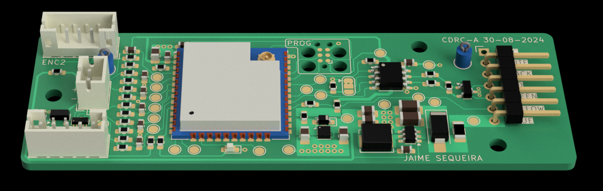

## Audison DRC Interface Project

Welcome to the project. The aim is to reverse engineer the Audison DRC and create a custom version of it. The end-goal is to have a unit that stays tucked inside the dashboard. We will use potentiometers to control the main volume and subwoofer volume on the fly. Additional controls can be access with a web interface - I'm thinking an ESP32 to make life easy.

These are the required steps for the project:

- [ ] Teardown of the DRC. Work out the basic electronics and schema
- [ ] Snoop on the DRC interface with the main DSP unit
- [ ] Create a prototype using a breadboard. Verify functionality
- [ ] Create a PCB and housing to replace the DRC with our version

## RS485 Packet Capture and Decoding

The following Google Doc outlines the packets transmitted and received by the DRC
https://docs.google.com/document/d/1xm5VXMs9jcL1oQyPIb4WubiSsU_rn1Bk5Yaru9MKfjI/edit?usp=sharing

## Hardware Report for the Custom DRC (CDRC) PCB

The following Google Doc is a HW report for the PCB. This includes a BOM and pinout diagram
https://docs.google.com/spreadsheets/d/1yKb0Uep4GiwMZgCa3Em3xfYRrIc_w2GCmBEI8sHW7xg/edit?usp=sharing

