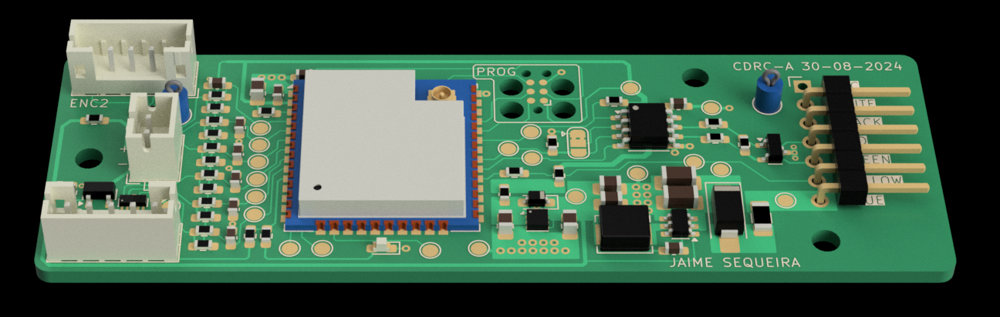
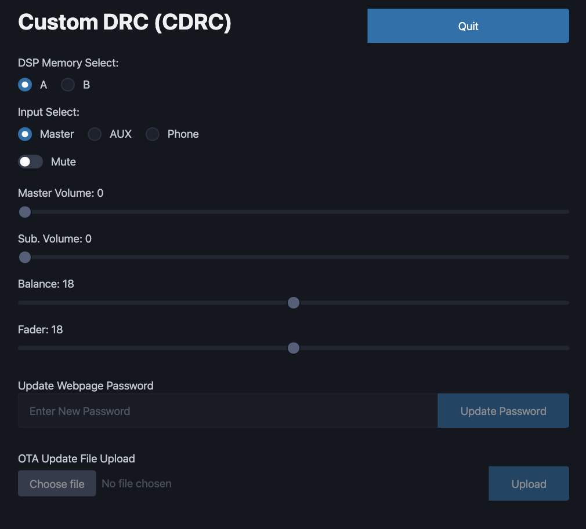
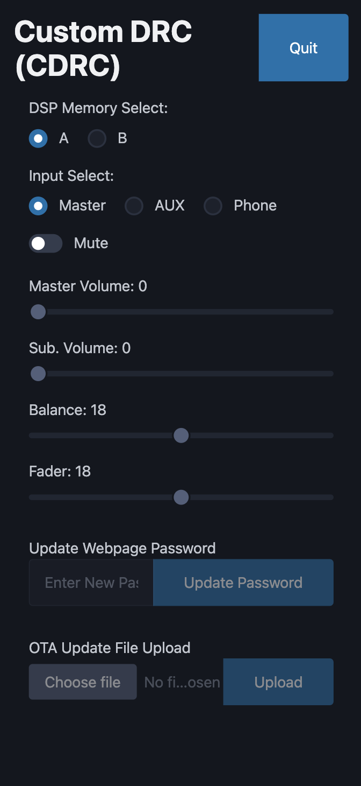
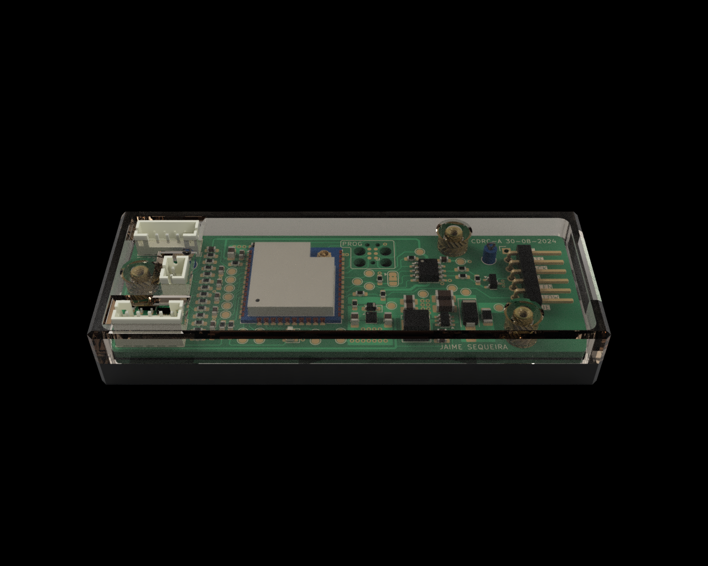
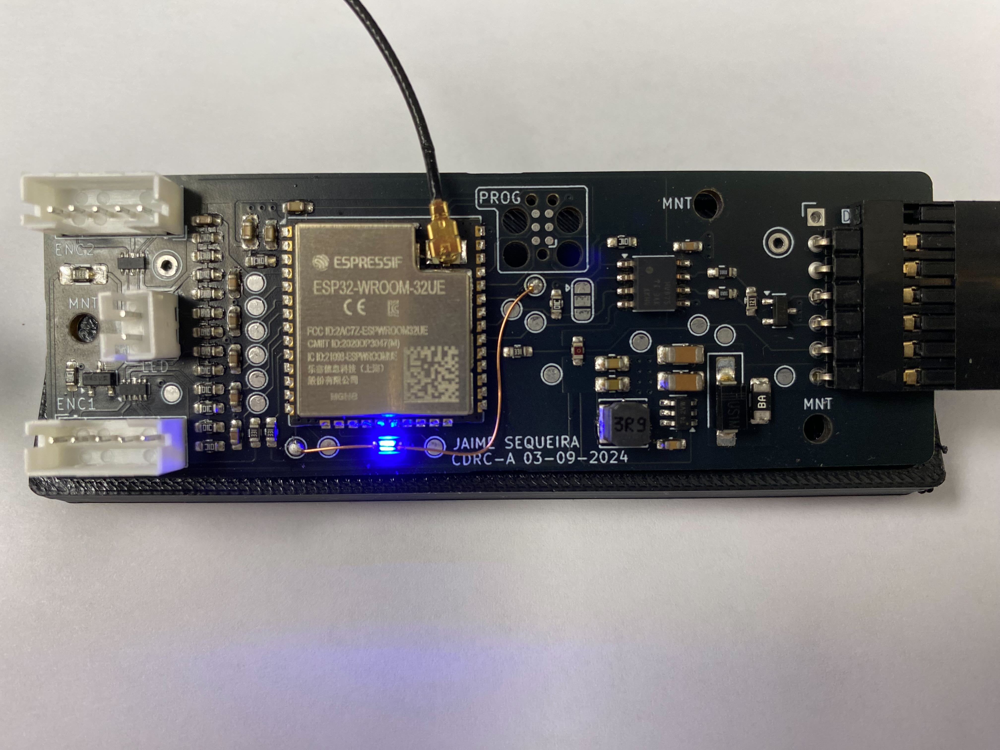
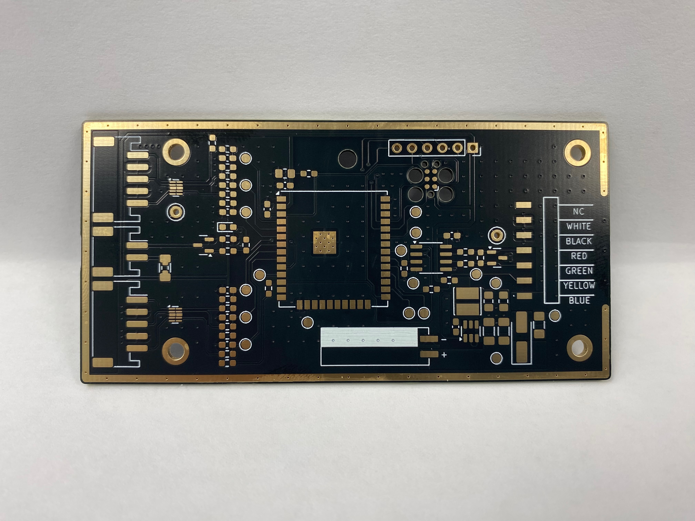
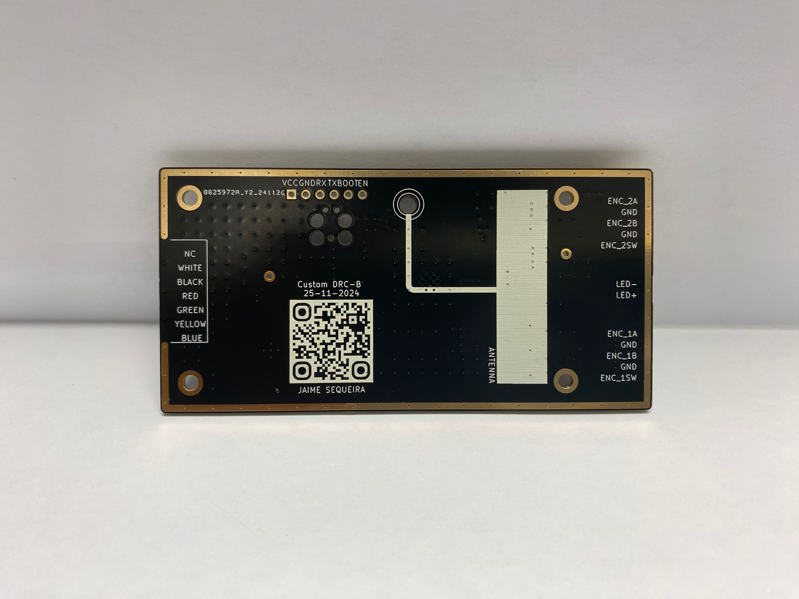
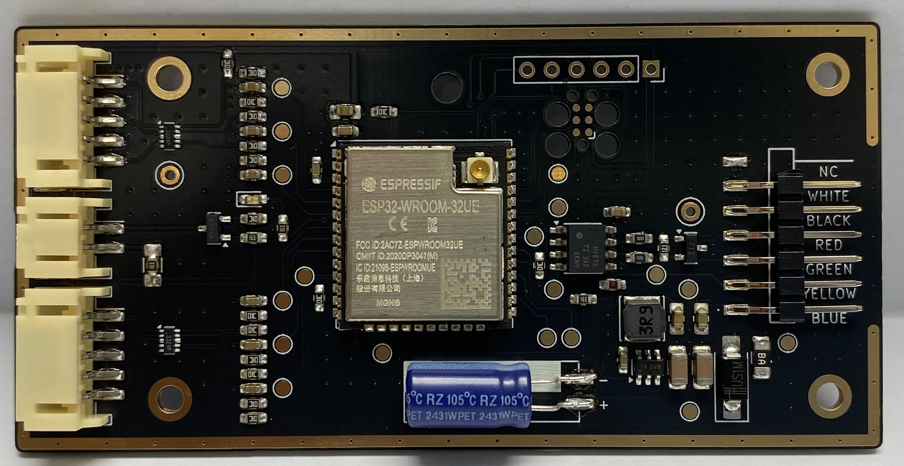

# Bit Ten DRC Interface Project

## A simple, cheap and opensource alternative to the Bit Ten DRC

Welcome to the project. The aim is to reverse engineer the DRC and create a custom version of it. The end-goal is to have a unit that stays tucked inside the dashboard. We will use rotary encoders to control the main volume and subwoofer volume on the fly. Additional controls can be accessed with a web interface - I'm thinking an ESP32 to make life easy.

These are the required steps for the project:

- [x] Teardown of the DRC. Work out the basic electronics and schema
- [x] Snoop on the DRC interface with the main DSP unit
- [x] Create a prototype using a breadboard. Verify functionality
- [x] Create a PCB and housing to replace the DRC with our version

## RS485 Packet Capture and Decoding

The following Google Doc outlines the packets transmitted and received by the DRC
https://docs.google.com/document/d/1xm5VXMs9jcL1oQyPIb4WubiSsU_rn1Bk5Yaru9MKfjI/edit?usp=sharing

## Hardware Report for the Custom DRC (CDRC) PCB

The following Google Doc is a HW report for the PCB. This includes a BOM and pinout diagram
https://docs.google.com/spreadsheets/d/1yKb0Uep4GiwMZgCa3Em3xfYRrIc_w2GCmBEI8sHW7xg/edit?usp=sharing

## Web Interface for CDRC

|  |
| :---------------------------------------------------------------: |
|                  _CDRC Web Interface - iPad Pro_                  |

|  |
| :------------------------------------------------------------------------: |
|                    _CDRC Web Interface - iPhone 12 Pro_                    |

## Update 1 - Rev A Hardware

|  |
| :-----------------------------------------------------------------------------: |
|                      _Custom DRC - Rev A Assembly Render_                       |

|  |
| :-------------------------------------------------------------------: |
|                   _Custom DRC - Rev A Manufactured_                   |

Rev A working well. Mod required to jump the RS485 RX line to a test-point pad to allow for wakeup on activity (requires pin to be in RTC power domain)

## Update 2 - Rev B Hardware

|  |
| :-------------------------------------------------------------------: |
|                   _Custom DRC - Rev B Board Front_                    |

|  |
| :------------------------------------------------------------------: |
|                   _Custom DRC - Rev B Board Rear_                    |

|  |
| :-----------------------------------------------------------------------: |
|                   _Custom DRC - Rev B Board Populated_                    |

Rev B saw fixes regarding issues with Rev A, an update to the board outline and an update to a fully SMD design. Device is fully functional
