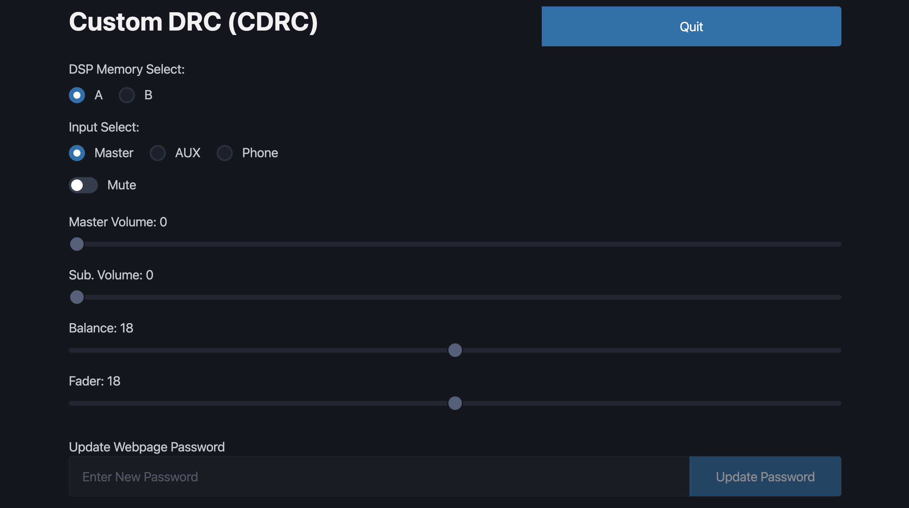

# Custom DRC - Web Design

I am by no means a software developer. I use VSCode with the [Live Server extension](https://github.com/ritwickdey/vscode-live-server-plus-plus) installed and enabled. This lets me run a local server and observe changes to the web interface in real time.

HTML, CSS and JS is loaded into flash with the firmware. It is not loaded into SPIFFS. This lets us update the FE with an OTA update through the local web server without also having to update the SPIFFS partition. The minified version of picocss is used for space saving on ESP32.

_convert_to_headers.py_ was created to speed up the process of creating C compatible arrays embedded into the firmware. This script takes index.html, pico.min.css and index.js files and converts them into C header files containing pointers to the byte array of the file.

Requirements for convert_to_headers.py:

- [ ] Create a python venv in this root directory
- [ ] Run the python script with your venv - may require installing dependecies with venv pip

The script puts all created header files into the _CDRC_headers_ folder. These header files can be transferred to the _Firmware/AC_Link_Control/lib/CDRCWebServer_ folder.
